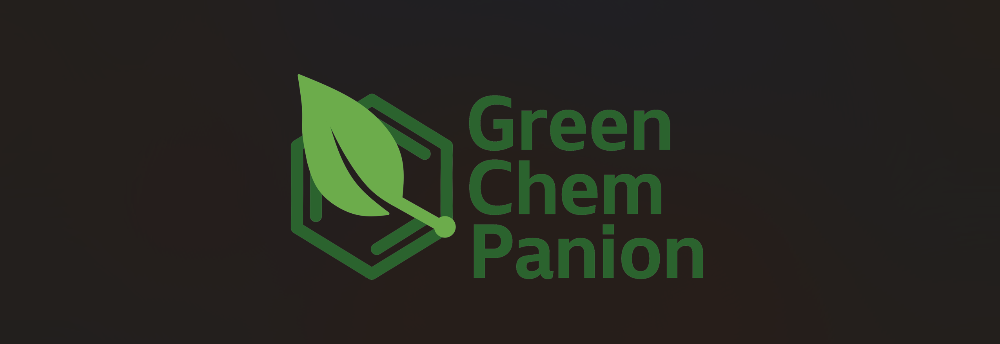

<h1 align="center">
GreenChemPanion
</h1>

### *Your Python-based companion for Green Chemistry!*
A Practical Programming for Chemistry project by Marc A, Ralph G, Tais T, Valentine W. 🇱🇧 🇺🇸 🇫🇷 🇧🇪
<br>


#### **GreenChemPanion**, or **GCP**, is a Python Package and Applet, based on RDKit and Streamlit, providing functions as well as an interface to compute Green Chemistry factors of a reaction or a molecule!


## 👩‍💻 Installation

First start by cloning the GCP Repository:
```
git clone https://github.com/ralphgebran/greenchempanion
```

Next step is to install the environement containing all GreenChemPanion dependencies!

Make sure your terminal is on the folder containing the .yml files, which should be the `src` folder.
```
cd "YourRepoLocation"/src
```

- If you are on Windows 🪟:
```
conda env create -f env_win.yml
```

- If you are on Mac 🍏:
```
conda env create -f env_mac.yml
```

Activate the environment
```
conda activate gcp
```

Then, making sure your terminal is on the ROOT folder of the project (the one where `src` and `pyproject.toml` are located), you can pip install the project:
```
(gcp) pip install -e .
```

Now GCP should be present in your environment, and you can use its functions by importing it in your python files!
```python
from greenchempanion import ...
```

If you need jupyter lab, install it 

```
(gcp) $ pip install jupyterlab
```

## 🔥 Features
GCP provides many tools for Green Chemistry purposes, through its python functions and integrated Streamlit applet.

What GCP has to offer:
- Store chemical reactions in a way suited for computer programming, with the `Reaction` class.
- Compute atom economies, for a given reaction, based on mass (`Atom_Economy_M`) or atom count (`Atom_Economy_A`).
- Check if a given reaction is well balanced, using the `isBalanced()` method.
- Compute the PMI and the E-factor of a given process (reaction + extra material used + yield) using `compute_PMI` and `compute_E` functions
- Get a Green Chemistry assessment of your process (Potentially polluting atoms, groups and solvents in the reaction, logP  evaluation ...) on the Streamlit app.
- ... and much more! You can find details on all functionalities in the `mini_documentation.md` document.


## 🛠️ Development installation

Initialize Git (only for the first time). 

Note: You should have create an empty repository on `https://github.com:ralphgebran/greenchempanion`.

```
git init
git add * 
git add .*
git commit -m "Initial commit" 
git branch -M main
git remote add origin git@github.com:ralphgebran/greenchempanion.git 
git push -u origin main
```

Then add and commit changes as usual. 

To install the package, run

```
(greenchempanion) $ pip install -e ".[test,doc]"
```

### Run tests and coverage

```
(conda_env) $ pip install tox
(conda_env) $ tox
```
