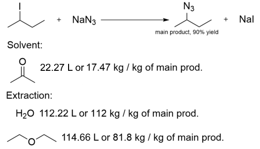

<h1 align="center">
GreenChemPanion 🍃
</h1>

### *Your Python-based companion for Green Chemistry!*
A Practical Programming for Chemistry project by Marc A, Ralph G, Tais T, Valentine W. 🇱🇧 🇺🇸 🇫🇷 🇧🇪
<br>


#### **GreenChemPanion**, or **GCP**, is a Python Package and Applet, based on RDKit and Streamlit, providing functions as well as an interface to compute Green Chemistry factors of a reaction or a molecule!

## 🔥 Features
GCP provides many functions helping to calculate Green Chemistry factors and analyse reactions. Most of them are centered around the main component of this package: the `Reaction` class!

### 1️⃣ **The Reaction class**
This class helps organise chemical reactions in a form suited for programming. It has three components:
- A first dictionary for reactants `Dict[Mol:int]` containing molecules and their associated stoichiometric coefficients
- A second dictionary for products `Dict[Mol:int]` containing molecules and their associated stoichiometric coefficients
- An integer `int` representing the main product's index in the second dictionary, which is set to `0` by default
```python
from rdkit import Chem
from rdkit.Chem.rdchem import Mol
from greenchempanion import Reaction

# Methane Combustion
methane = Chem.MolFromSmiles("C")
dioxygen = Chem.MolFromSmiles("O=O")
carbon_dioxide = Chem.MolFromSmiles("O=C=O")
water = Chem.MolFromSmiles("O")

methane_comb = Reaction({methane: 1, dioxygen:2}, {carbon_dioxide:1, water:2})
# Carbon Dioxide is set as the main product
```


### 2️⃣ **Preliminary functions**
Two smaller-scale functions are present, which are used in the more significant operations:
- `Atom_Count_With_H(compound: Mol)` : Takes a Mol object as an argument, and gives the total count of all atoms in the compound, including the hydrogen atoms (unlike RDKit's `GetNumAtoms` method which, on its own, always assumes a given Mol is counted without its H atoms)
```python
from greenchempanion import Atom_Count_With_H

# RDKit GetNumAtoms
print(methane.GetNumAtoms()) # Output should be 1
# GCP Atom_Count_With_H
print(Atom_Count_With_H(methane)) # Output should be 5
```

- `canonicalize_smiles(smiles: string)` : Takes a SMILES format string as input, and outputs the canonicalized SMILES format as a string.
```python
from greenchempanion import canonicalize_smiles

print(canonicalize_smiles("C(C)O")) # Output should be CCO
```

### 3️⃣ **Atom Economy (methods of the `Reaction` class)**
Two methods are programmed into the `Reaction` class, which output atom economy:

- `Atom_Economy_A` : Atom Economy based on the number of atoms 

Numerical Operation: `[Number of atoms in Main Product / Number of atoms in Reactants] * 100`
```python
print(methane_comb.Atom_Economy_A()) # Output should be 33.33 %
```

- `Atom_Economy_M` : Atom Economy based on molar masses 

Numerical Operation: `[Molar Mass of Main Product / Molar Mass of Reactants] * 100`
```python
print(methane_comb.Atom_Economy_M()) # Output should be 55 %
```

### 4️⃣ **PMI and E-Factor Functions**
The two Green Chemistry factors are present as functions, which take three arguments:
- A GCP `Reaction`
- A dictionary for extras, such as solvents or extraction material `Dict[Mol:float]` containing molecules and their masses in grams, per kilogram of main product
- The main product's yield, as a `float`

```python
from greenchempanion import compute_PMI, compute_E

# Compounds of a SN reaction
sodium_azide = Chem.MolFromSmiles("[N-]=[N+]=[N-].[Na+]")
two_iodobutane = Chem.MolFromSmiles("CCC(I)C")
two_azidobutane = Chem.MolFromSmiles("CCC([N]=[N+]=[N-])C")
sodium_iodide = Chem.MolFromSmiles("[Na+].[I-]")

# Solvent and Extraction compounds
acetone = Chem.MolFromSmiles("CC(=O)C")
ether = Chem.MolFromSmiles("CCOCC")

sn_reaction = Reaction({two_iodobutane:1, sodium_azide:1}, {two_azidobutane:1, sodium_iodide:1})
sn_extras = {acetone:17470, water:112000, ether:81800}

# The two functions !
sn_reaction_pmi = compute_PMI(sn_reaction, sn_extras , 0.9)
sn_reaction_e= compute_E(sn_reaction, sn_extras, 0.9)
```


#### 4️⃣🅰️ **PMI: `compute_PMI`**
The Process Mass Index, or PMI, measures the amount of materials used in a given reaction, per kilogram of main product (accounting for the yield).

Numerical Operation: `Mass of Reactants per kg of Main Product + Mass of Extras per kg of Main Product`

```python
print(sn_reaction_pmi) # Output should be 214
```

#### 4️⃣🅱️ **E-Factor: `compute_E`**
The E-Factor measures the amount of waste produced by a given reaction, per kilogram of main product (accounting for the yield).

Numerical Operation: `Mass of Side Products per kg of Main Product + Mass of Extras per kg of Main Product`

```python
print(sn_reaction_e) # Output should be 212.9
```


## 👩‍💻 Installation

First start by cloning the GCP Repository:
```
git clone https://github.com/ralphgebran/greenchempanion
```

Next step is to install the environement containing all GreenChemPanion dependencies!

Make sure your terminal is on the folder containing the .yml files, which should be the `src` folder.
```
cd "YourRepoLocation"/src
```

- If you are on Windows 🪟:
```
conda env create -f env_win.yml
```

- If you are on Mac 🍏:
```
conda env create -f env_mac.yml
```

Activate the environment
```
conda activate gcp
```

If you need jupyter lab, install it 

```
(gcp) $ pip install jupyterlab
```

## 🌐 Streamlit Applet
In the `src/greenchempanion/` folder of the repository, the `app.py` file is present, containing the interactive applet.

Make sure your terminal is on the `greenchempanion` folder
```
cd "YourRepoLocation"/src/greenchempanion
```

Run the applet
```
streamlit run app.py
```

The applet should open on local tab in your default browser. Feel free to experiment with the different sections, which showcase the GCP fuctionalities!

### 1️⃣ **SMILES Converters**

Two tools are present on the app to help the user with SMILES, which serves as the principal format for molecular inputs on the applet. 

#### 1️⃣🅰️ **SMILES to Molecule converter**

To double check a SMILES, or try to write it yourself, you can input a SMILES string in a text box (1), which will output an image of the given SMILES, as well as the molecule's atom count (3) as a showcase of the `Atom_Count_With_H()` function.


#### 1️⃣🅱️ **Molecule to SMILES converter**

To draw a molecule and obtain its SMILES, you can draw the structure on the provided interface (4), and then click Apply (5), which will output the given SMILES (8), as well as the molecule's atom count (9).

To erase all drawn structures, use the Reset button (6), and to reboot the whole module, use the Reset drawing and SMILES button (7).


### 2️⃣ **Enter a reaction**

This section contains two sections to add elements of your chemical reaction.

#### 2️⃣🅰️ **Add a molecule**
Input a molecule for your reaction, by writing its SMILES in (10), its stoichiometric coefficient in (11), and selecting whether it's a reactant or a product using the radio buttons (12). Finally, the Add Molecule button (13) will store the entry in the reaction.


#### 2️⃣🅱️ **Add extras**
Input the main product yield (17), and add solvents and extraction materials, by writing the SMILES in (14), the mass (grams) used per kilogram of product in (15). Finally, the Add Molecule button (16) will store the entry in the reaction.


### 3️⃣ **Stored Reaction and Compute Factors**
Under the two expanders are two columns:

The first (18) displays the reaction components you added: Reactants (20), Products (21) and Extras (24). Under the Products section, you can choose which compound is the main/desired product using the radio buttons (22), which will be marked with a label (23).

The second (19) contains three buttons which appear once a reaction is entered (25). Each one computes the given factor, and displays the result under the button.


### 4️⃣ **Green Chemistry Evaluation**
MIAW MIAW MIAW PLACEHOLDER

 marc si tu comprend comment ca marche chaque point essaye de briefly l'expliquer 👉🏻👈🏻


## 🛠️ Development installation

Initialize Git (only for the first time). 

Note: You should have create an empty repository on `https://github.com:ralphgebran/greenchempanion`.

```
git init
git add * 
git add .*
git commit -m "Initial commit" 
git branch -M main
git remote add origin git@github.com:ralphgebran/greenchempanion.git 
git push -u origin main
```

Then add and commit changes as usual. 

To install the package, run

```
(greenchempanion) $ pip install -e ".[test,doc]"
```

### Run tests and coverage

```
(conda_env) $ pip install tox
(conda_env) $ tox
```
